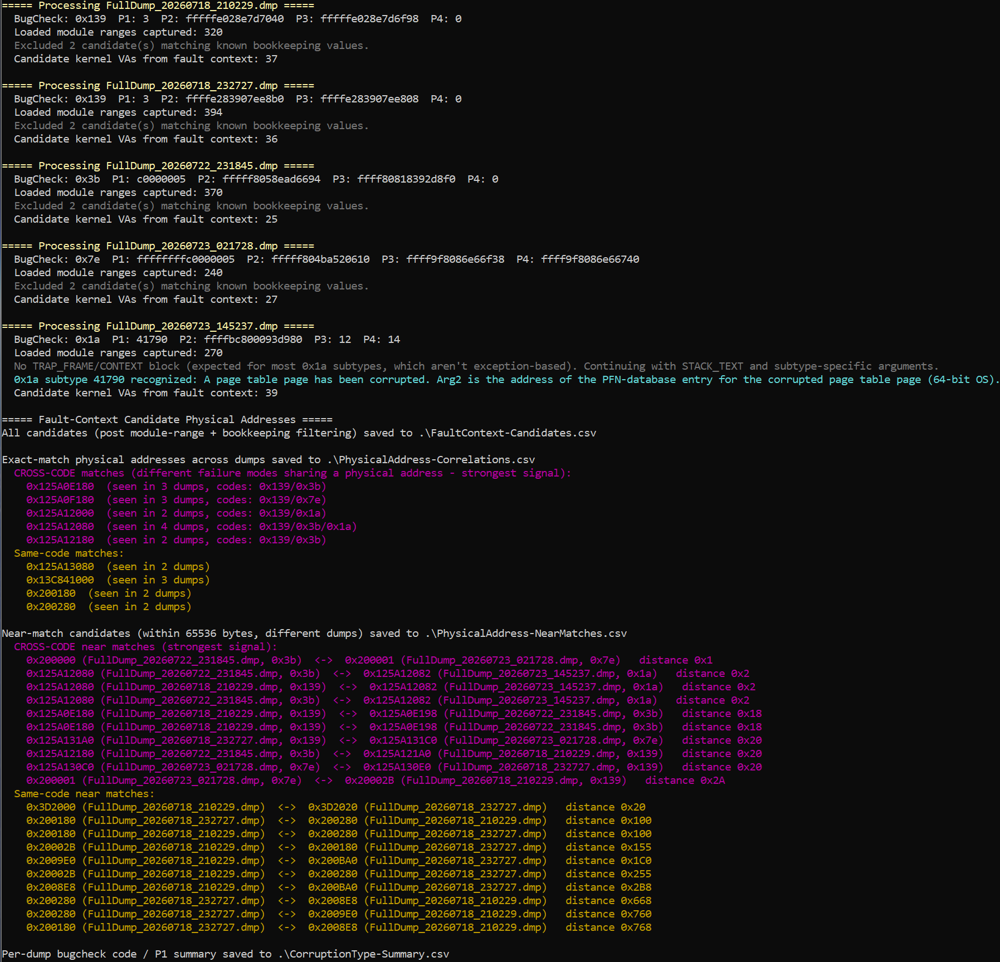

# ddr5-aio-analysis.md

- [ddr5-aio-analysis.md](#ddr5-aio-analysismd)
  - [Set up your environment](#set-up-your-environment)
    - [Prevent Windows from overwriting the last crash dump](#prevent-windows-from-overwriting-the-last-crash-dump)
      - [1. PowerShell script: `SetDumpPath.ps1`](#1-powershell-script-setdumppathps1)
      - [2. Backup your default crash settings (for reference)](#2-backup-your-default-crash-settings-for-reference)
      - [3. Create scheduled task (`CrashDumpPathRotation`)](#3-create-scheduled-task-crashdumppathrotation)
      - [4. Test crash dump creation](#4-test-crash-dump-creation)
  - [Analysing dump files for faulty DDR5 RAM](#analysing-dump-files-for-faulty-ddr5-ram)
    - [Key questions](#key-questions)
    - [What we can't ascertain](#what-we-cant-ascertain)
    - [Caveats: what dump analysis cannot rule out](#caveats-what-dump-analysis-cannot-rule-out)
    - [Memory interleaving](#memory-interleaving)
      - [Where to find it in the BIOS](#where-to-find-it-in-the-bios)
        - [On AMD systems](#on-amd-systems)
        - [On Intel systems](#on-intel-systems)
        - [Legacy / alternative terms](#legacy--alternative-terms)
  - [DDR5 corrupted memory crash analysis and reporting](#ddr5-corrupted-memory-crash-analysis-and-reporting)

## Set up your environment

### Prevent Windows from overwriting the last crash dump

Windows always overwrites the last crash dump file. By design, Windows has no native method to prevent this. The only practical workaround is to dynamically change the dump filename on every boot.

#### 1. PowerShell script: `SetDumpPath.ps1`

```powershell
# This script ensures the dump directory exists and sets a unique filename so Windows will not overwrite the dump
$DumpRoot = "C:\CrashDumps"

# Ensure directory exists
if (!(Test-Path $DumpRoot)) {
    New-Item -ItemType Directory -Path $DumpRoot | Out-Null
}

# Generate unique filename
$Timestamp = (Get-Date).ToString("yyyyMMdd_HHmmss")
$DumpFile = "$DumpRoot\FullDump_$Timestamp.dmp"

# CrashControl registry path
$RegPath = "HKLM:\SYSTEM\CurrentControlSet\Control\CrashControl"

# Ensure full dump mode
Set-ItemProperty -Path $RegPath -Name "CrashDumpEnabled" -Value 1

# Set dump filename
Set-ItemProperty -Path $RegPath -Name "DumpFile" -Value $DumpFile
```

#### 2. Backup your default crash settings (for reference)

Backup the existing registry crash setting, which will look something like the below, here the "DumpFile" entry in hex translates to `%SystemRoot%\MEMORY.DMP`

```reg
Windows Registry Editor Version 5.00

[HKEY_LOCAL_MACHINE\SYSTEM\CurrentControlSet\Control\CrashControl]
"AutoReboot"=dword:00000001
"CrashDumpEnabled"=dword:00000001
"DumpFile"=hex(2):25,00,53,00,79,00,73,00,74,00,65,00,6d,00,52,00,6f,00,6f,00,\
  74,00,25,00,5c,00,4d,00,45,00,4d,00,4f,00,52,00,59,00,2e,00,44,00,4d,00,50,\
  00,00,00
"DumpLogLevel"=dword:00000000
"EnableLogFile"=dword:00000001
"LogEvent"=dword:00000001
"MinidumpDir"=hex(2):25,00,53,00,79,00,73,00,74,00,65,00,6d,00,52,00,6f,00,6f,\
  00,74,00,25,00,5c,00,4d,00,69,00,6e,00,69,00,64,00,75,00,6d,00,70,00,00,00
"MinidumpsCount"=dword:00000005
"Overwrite"=dword:00000001
"DumpFilters"=hex(7):64,00,75,00,6d,00,70,00,66,00,76,00,65,00,2e,00,73,00,79,\
  00,73,00,00,00,00,00
"AlwaysKeepMemoryDump"=dword:00000000
```

#### 3. Create scheduled task (`CrashDumpPathRotation`)

Scheduled a task to run SetDumpPath.ps1 at boot which ensure that at every boot time the dump file name gets updated, alter the path below according to where you put the SetDumpPath.ps1 script.

Create a new task (not a Basic Task) with the following settings:

**General tab:**

- Name: `CrashDumpPathRotation`
- Security options:
  - Run whether user is logged on or not
  - Run with highest privileges
  - User account: **SYSTEM**

**Triggers tab:**

- New Trigger → **At startup** → Enabled

**Actions tab:**

- Program/script: `powershell.exe`
- Arguments:
  ```
  -ExecutionPolicy Bypass -File "C:\Users\andrew\Documents\crash_analysis\SetDumpPath.ps1"
  ```

**Conditions tab:**

- Disable all conditions

**Settings tab:**

- Allow task to be run on demand
- Run task as soon as possible after a scheduled start is missed
- Restart task every 1 minute if it fails, up to 3 times

Run the task manually to verify it works.

#### 4. Test crash dump creation

Test that this creates the correct filename with `hold right Ctrl, then tap Scroll Lock twice`, for USB keyboards use

```reg
Windows Registry Editor Version 5.00

[HKEY_LOCAL_MACHINE\SYSTEM\CurrentControlSet\Services\kbdhid\Parameters]
"CrashOnCtrlScroll"=dword:00000001
```

Reboot and test by holding **Right Ctrl** then tapping **Scroll Lock** twice.

---

## Analysing dump files for faulty DDR5 RAM

We want to find, if possible, commonalities between the crash dumps. We know that the Windows stop code changes depending on which Windows structure is corrupted, so short of physical analysis (with FIB, e-beam, or decapping and visual inspection, to ascertain if the defect is in the refresh counter, the row decoder, or the bank multiplexer) we can look for this in the dump files:

### Key questions

- Is the corruption **physical-address-dependent**?
- Does corruption occur across boots at the **same physical address** suggesting a stuck data bit or weak cell(s)?

We know from the 59 tests I ran against my X870E-E system with this RAM

- DATA AX5U6000C3032G 2×32 GB, SK Hynix A‑die (4.1), dual‑rank, EXPO 6000 MT/s CL30-40-40-76 (does not support RFM) - QVL listed

that for my fault, the trigger is refresh-count-invariant, meaning that it always happens after the same total number of refresh commands, no matter how the conditions are changed with 'bank refresh mode' or tREFI.

### What we can't ascertain

| Mechanism                 | Fault Description                                                                                             | What you'd see in dumps                                                   |
| ------------------------- | ------------------------------------------------------------------------------------------------------------- | ------------------------------------------------------------------------- |
| tRFC violation            | Refresh issued too fast for defective row to recover; happens after N refreshes due to cumulative charge loss | Random physical addresses, no XOR pattern, no duplicate data              |
| Bank group decoder fault  | Refresh targets wrong bank group; happens at fixed refresh count if bank counter is defective                 | Scattered physical addressess, possibly in same bank-group-aligned region |
| Sense amplifier failure   | The sense amp for a specific row/bank fails after N activations                                               | Same row or adjacent rows, but data is garbage not copied                 |
| Word-line stuck-on        | A word-line remains activated, corrupting adjacent rows via charge sharing                                    | Adjacent-row pattern, but not identical data                              |
| On-die ECC scrubber fault | DDR5's ECC scrubber activates at refresh time and writes wrong data                                           | Random pattern, no address correlation                                    |

### Caveats: what dump analysis cannot rule out

**1. Stuck counter bit (same physical address)**

Will detect if: the refresh counter truly gets stuck and always refreshes the same row, and that row happens to contain a kernel structure that crashes the system.

Might miss if:

- The counter doesn't get "stuck" but instead overflows and wraps around, hitting different rows on different boots
- The corrupted row contains user data or free memory that doesn't immediately crash — Windows keeps running until a different structure gets hit
- The memory controller's bank interleaving or XOR scrambling spreads the "same row" across multiple physical addresses that don't look identical
- The crash happens because a refresh is skipped (counter jumps) rather than stuck

A refresh counter is typically 13–16 bits (8192–65536 rows). If bit 12 is stuck, you have 2 rows that alternate. If the counter overflows at N≈10.9 billion, it could be wrapping through the entire address space multiple times. The "same PA" pattern is only guaranteed if the counter is truly frozen, not just faulty.

**2. Address line failure (XOR = power of 2)**

Will detect if: an internal address line (A0–A16) is stuck-at-0 or stuck-at-1, causing the refresh to consistently target row ^ (1 << N).

Might miss if:

- The address failure is intermittent (thermal/voltage dependent on the decoder, not the cell)
- The failure is in the bank decoder (3 bits) rather than the row decoder, which would produce a different pattern
- The failure is in the column decoder (within-row corruption, not wrong-row)
- DDR5's on-die address scrambling (for Rowhammer mitigation) obfuscates the physical-to-logical mapping

Modern DRAM chips scramble addresses to defeat Rowhammer. The physical row number you compute from the system physical address is not the internal row number the DRAM uses. A stuck bit in the internal row counter might not produce a clean power-of-2 XOR in system physical addresses.

**3. Row copy error (identical data at different addresses)**

Will detect if: one row is being refreshed into another, producing a perfect byte-for-byte copy.

Might miss if:

- The copied data gets subsequently overwritten by normal CPU writes before the crash
- The corruption is partial (only some columns in the row are copied)
- The crash happens because the target row loses charge (wasn't refreshed), not because the source row was copied into it

For this to work, the "wrong row" must contain data that was valid at some point and is now sitting in a different row. If the DRAM refreshes row X into row Y, but then the CPU writes new data to row Y, the copy evidence is destroyed.

### Memory interleaving

Ideally, test with only one stick in your system. If you use more than one, you'll need to disable memory interleaving.

Memory interleaving is known by several names across different BIOS systems and motherboards. In a BIOS/UEFI setup, it is typically named based on the specific **hardware layer** being interleaved.

#### Where to find it in the BIOS

##### On AMD systems

Look under the **AMD CBS** (Core Complex System) menu:

> `Advanced` $\rightarrow$ `AMD CBS` $\rightarrow$ `DRAM Controller Configuration` or `Data Fabric Options`

- Common options: **Memory Interleaving**, **Memory Interleaving Size** (e.g., 256B, 512B, 1KB, Auto), or **Channel Interleaving Hash**.

##### On Intel systems

Look under the primary memory or processor configuration settings:

> `Advanced` $\rightarrow$ `System Agent (SA) Configuration` $\rightarrow$ `Memory Configuration`

- Common options: **Channel Interleaving**, **IMC Interleaving**, or **Sub-NUMA Clustering (SNC)**.

##### Legacy / alternative terms

- **Ganged / Unganged Mode** _(Older AMD platforms like Phenom II/FX)_:
- **Unganged** = Interleaved (two independent 64-bit channels; better performance).
- **Ganged** = Non-interleaved (one combined 128-bit channel).

---

Taking all of the above into consideration:

## DDR5 corrupted memory crash analysis and reporting

| file                                                                                                            | description                                                                                                                                                                                                                                                                                                                                                                    |
| --------------------------------------------------------------------------------------------------------------- | ------------------------------------------------------------------------------------------------------------------------------------------------------------------------------------------------------------------------------------------------------------------------------------------------------------------------------------------------------------------------------ |
| [ddr5-aio-analysis.ps1](https://github.com/ExponentiallyDigital/crash_analysis/blob/main/ddr5-aio-analysis.ps1) | DDR5 "all-in-one" analysis for faulty RAM: extracts candidate corrupted-memory addresses from `KERNEL_SECURITY_CHECK_FAILURE` (0x139), `SYSTEM_SERVICE_EXCEPTION` (0x3b), `SYSTEM_THREAD_EXCEPTION_NOT_HANDLED` (0x7e), and `MEMORY_MANAGEMENT` (0x1a) dumps, and correlates the resulting physical addresses (both exact matches and near misses) across multiple dump files. |

Sample output

<figure align="center">
  
  <figcaption>Console output</figcaption>
</figure>

[placeholder for created CSVs]

[placeholder for an example system log]

[placeholder for an example system journal]

---
